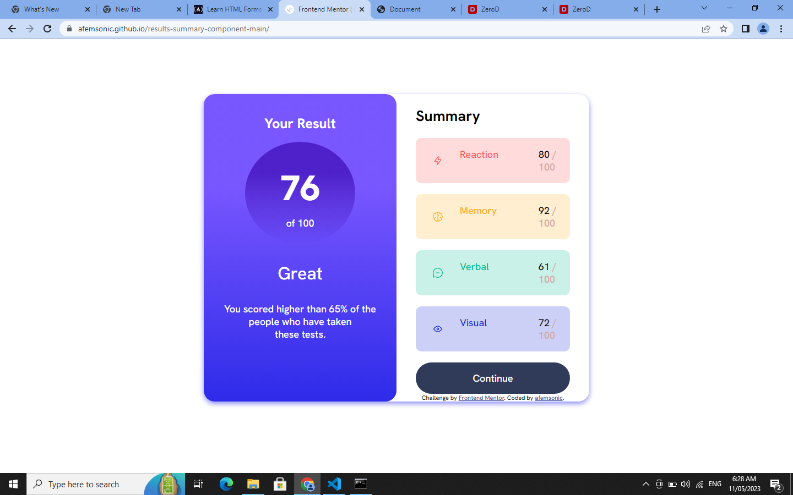

# Frontend Mentor - Results summary component solution

This is a solution to the [Results summary component challenge on Frontend Mentor](https://www.frontendmentor.io/challenges/results-summary-component-CE_K6s0maV). Frontend Mentor challenges help you improve your coding skills by building realistic projects. 

## Table of contents

- [Overview](#overview)
  - [The challenge](#the-challenge)
  - [Screenshot](#screenshot)
  - [Links](#links)
- [My process](#my-process)
  - [Built with](#built-with)
 
  - [What I learned](#what-i-learned)
  - [Continued development](#continued-development)
  - [Useful resources](#useful-resources)
- [Author](#author)
- [Acknowledgments](#acknowledgments)

## Overview

### The challenge

Users should be able to:

- View the optimal layout for the interface depending on their device's screen size
- See hover and focus states for all interactive elements on the page

### Screenshot

### Links

- Solution URL: [View solution url]([https://your-solution-url.com](https://github.com/afemsonic/results-summary-component-main)
- Live Site URL: [View live site URL here](https://your-live-site-url.com)

## My process

### Built with

- Semantic HTML5 markup
- CSS custom properties
- Flexbox
- Mobile-first workflow

### What I learned

I learnt the application of gradients.

Use this section to recap over some of your major learnings while working through this project. Writing these out and providing code samples of areas you want to highlight is a great way to reinforce your own knowledge.

### Continued development

I'll like to learn more about how to handle data.json file and how to integrate it into html. 

### Useful resources

- (https://www.w3schools.com/css/css3_gradients.asp) - This is an amazing article which helped me finally understand the right way to apply gradients in css. I'd recommend it to anyone still learning this concept.

## Author

- Frontend Mentor - [@afemsonic](https://www.frontendmentor.io/profile/afemsonic)
- Twitter - [@afemsonic](https://www.twitter.com/afemsonic)

